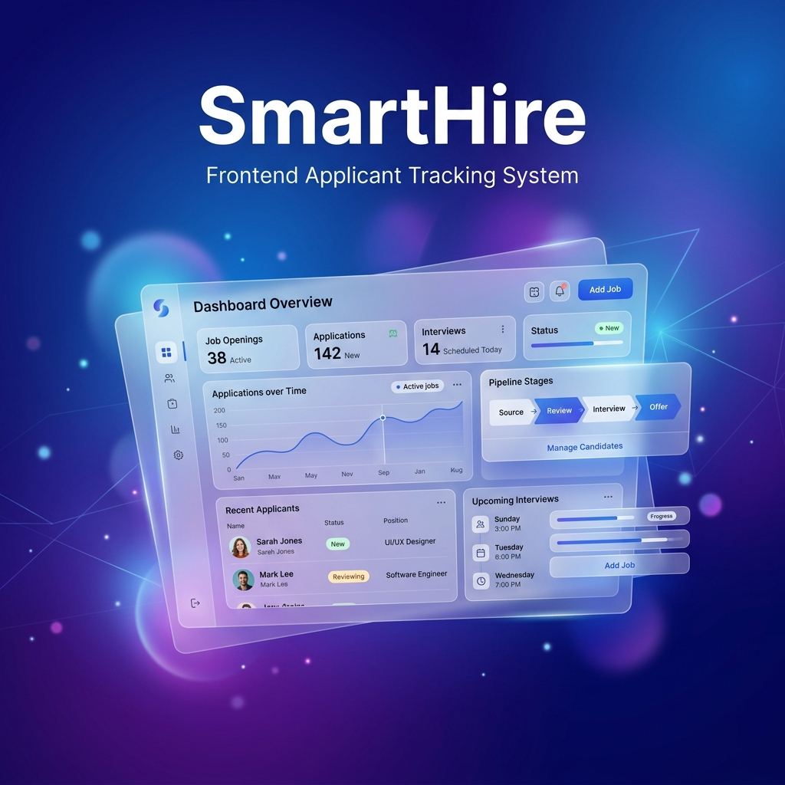
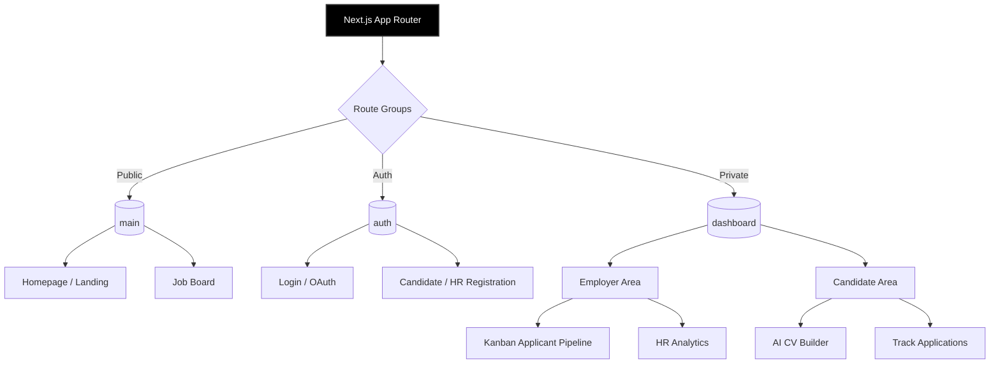
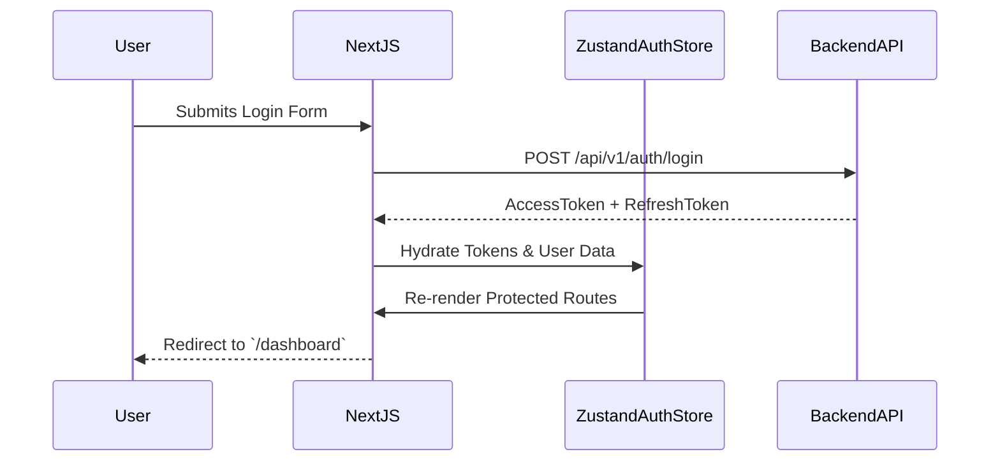

<div align="center">
  
</div>

# SmartHire Frontend Client 🌟

A comprehensive, cutting-edge Applicant Tracking System (ATS) showcasing an ultra-modern aesthetic. The SmartHire frontend is built with Next.js App Router for extreme performance, delivering a seamlessly fast, glassmorphism-inspired UI UX Pro Max experience for both Job Seekers and Employers.

## 🛠 Tech Stack Overview

| Category | Technology |
| :--- | :--- |
| **Framework** | Next.js 14+ (App Router), React 18 |
| **Language** | TypeScript (Strict Mode) |
| **Styling** | Tailwind CSS v3, Custom CSS Variables (Glassmorphism) |
| **Bundler** | Turbopack (Next.js) |
| **State Mgt** | Zustand (Global App State), Context API |
| **DevOps** | Multi-stage Docker (Standalone Mode Output) |

---

## 📐 Application Architecture & Flow

### Component & Routing Architecture
The frontend leverages the robust Next.js App Router to separate marketing pages, interactive dashboards, and authentication logic seamlessly.



### Authentication & Data Flow


---

## 📁 Project Structure Deep-Dive

```text
smart-hire-web/
├── public/                 # Static assets, branding, and images
│   └── smarthire_frontend_banner.png
├── src/
│   ├── app/                # File-based routing (App Router)
│   │   ├── (auth)/         # Authentication endpoints
│   │   ├── (dashboard)/    # Secure layout wrapped routes
│   │   └── (main)/         # Public landing, Jobs, About pages
│   ├── features/           # Domain-driven feature design
│   │   ├── auth/           # Login, Register, OAuth flows
│   │   ├── cv/             # Resume Builder, Templates, AI parsers
│   │   ├── employer/       # Kanban boards, Applicant Drawers
│   │   └── onboarding/     # Document verification steps
│   ├── shared/             # Reusable UI primitives, utils, API clients
│   │   ├── components/     # Buttons, Modals, Inputs, Cards
│   │   ├── store/          # Zustand states
│   │   └── lib/            # Axios interceptors, Token refresh logic
│   └── styles/             # Global CSS and Tailwind directives
├── Dockerfile              # Highly-optimized container spec
└── next.config.ts          # Turbopack, standalone mode, images config
```

---

## ✨ Elite Core Features

### 👨‍💼 For Candidates (Job Seekers)
- **🚀 AI Resume Builder Studio**: A meticulously crafted, visually stunning CV builder supporting dynamic layouts and instant real-time previews.
- **📄 Smart Document Parsing**: Upload legacy CVs and let the backend AI extract structural data seamlessly into the builder.
- **💼 Cinematic Job Discovery**: Browse job openings in a beautiful BENTO grid architecture.
- **📈 Real-time Application Tracking**: Visual timeline of exactly where your application sits in the queue.

### 🏢 For Employers & HR
- **👀 Interactive Applicant Board**: Comprehensive Kanban-style pipeline to drag-and-drop candidates through hiring stages with fluid animations.
- **📑 Digital Onboarding Hub**: Complete end-to-end onboarding for new hires, including Identity Document (ID_FRONT, ID_BACK) secure uploads and AI verification states.
- **📊 HR Analytics Dashboard**: Real-time KPI graphics on job conversions and pipeline drop-offs.

---

## 📦 Getting Started

### 1. Local Development (NPM)
```bash
git clone https://github.com/khoazandev/smart-hire-web.git
cd smart-hire-web

# Install dependencies (Ignore scripts if facing upstream issues)
npm install --ignore-scripts

# Populate local environment
cp .env.docker.example .env.local

# Run Development Server with Turbopack for ultra-fast HMR
npm run dev
# Accessible at http://localhost:3000
```

### 2. Production Docker Deployment
The frontend uses Next.js `output: 'standalone'` feature via a multi-stage Docker build to keep image sizes tiny and startup times instant.

```bash
# Build the highly optimized Docker container
docker-compose up -d --build
```

---

## 🔑 Environment Configuration

Ensure these are properly set in your `.env` physically or logically injected into your deployment container:

| Variable | Description | Default |
| :--- | :--- | :--- |
| `NEXT_PUBLIC_API_URL` | The external URL pointing to the Backend API | `http://localhost:8080` |
| `NEXT_PUBLIC_GITHUB_CLIENT_ID`| Required to trigger the OAuth2 flow from the client | *Your GitHub App ID* |
| `NEXT_TELEMETRY_DISABLED` | Privacy control for Next.js metrics | `1` |

---
<div align="center">
  <i>Redefining Recruitment Through Design & Data</i><br/>
</div>
